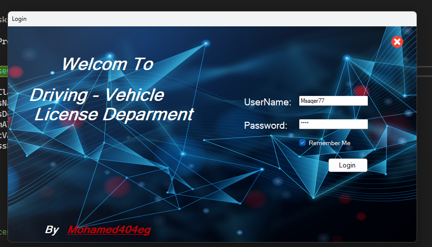

Project – Driving License Management:
This my project to Driving License Management in country ;

# Screenshot

# noetic

## Applications Status
- Applications.ApplicationStatus = 1 THEN 'New'
- WHEN Applications.ApplicationStatus = 2 THEN 'Cancelled'
- WHEN Applications.ApplicationStatus = 3 THEN 'Completed'
- END AS Status

# Main Features 
## create Applications
by Applications you can create withe Appointments or  InternationalLicenses or Local Licenses.
## TestAppointments
create TestAppointments to Take all Tetst in oreder to pass Test And Take Licenses
## Users and People
User is User work in Cmopany and administrator.
People is administrator User And Normal User Like driver.
# Image Size

- large x2 128px
- large 64px
- medium 32px
- small 24px

# IssueReason

- 1 License issuance service for the first time. Application fee is $5.
- 2 Re-inspection service. Application fee is $5.
- 3 Driving license renewal service. Application fee is $5.
- 4 Issuing a replacement for a lost license service. Application fee is $5.
- 5 Service for issuing a replacement for a damaged license. Application fee is $5.
- 6 Driving license cancellation service. Application fee is $5.
- 7 International license issuance service. Application fee is $5.

# Main features

##    Applications: Replacement for Damaged or Lost Licenses 

- Flow chart => https://whimsical.com/applications-replacement-for-damaged-or-lost-licenses-48AfgRiDmYSdKnKKwf9hTJ

